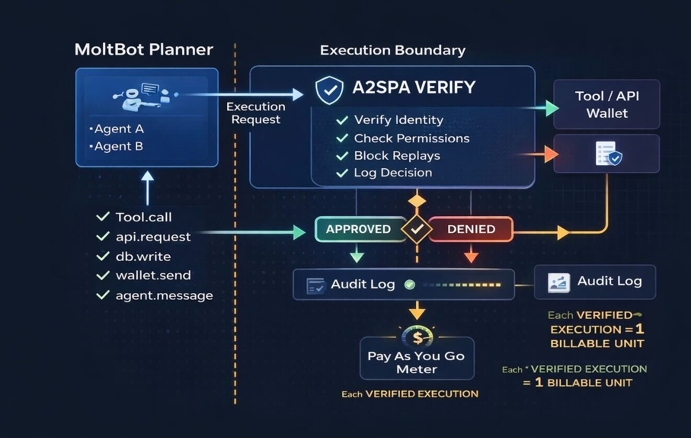

## MoltBot x A2SPA Execution Boundary

This diagram shows how to wrap MoltBot agent execution with A2SPA (Agent-to-Secure Payload Authorization)
as an execution-time authorization gate (APPROVED / DENIED), with audit logging and pay-as-you-go metering.

