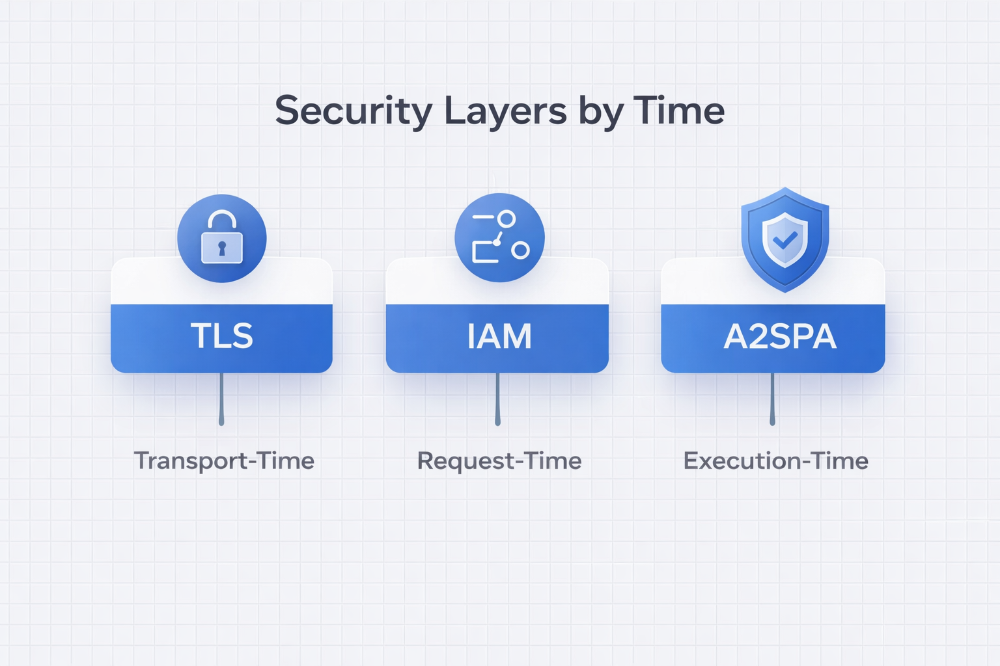
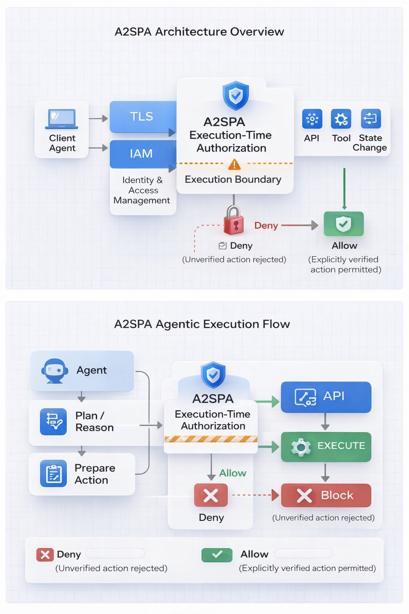
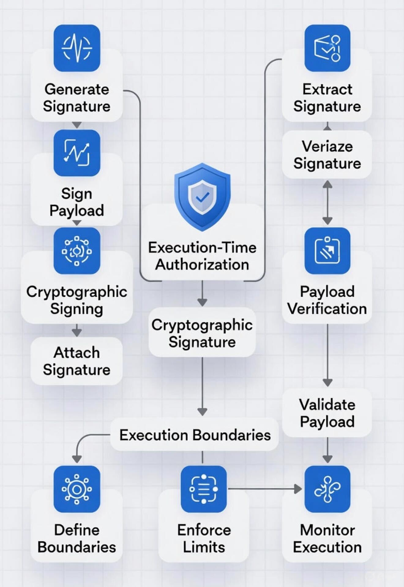
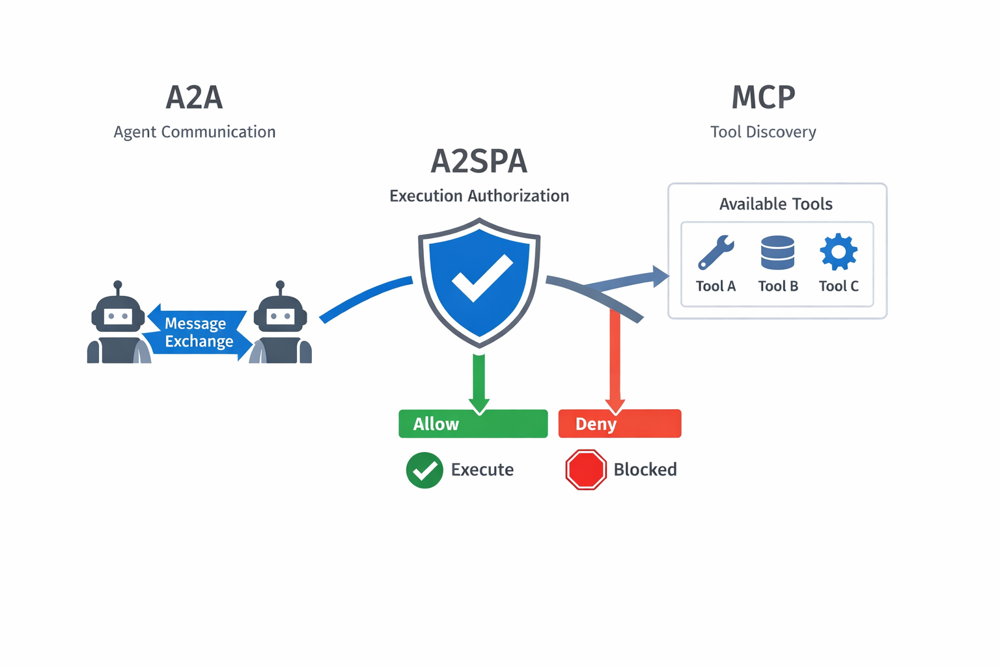

# A2SPA — Execution-Time Authorization for Agentic AI Systems

A2SPA (Agent-to-Secure Payload Authorization) defines **execution-time authorization**: the cryptographic verification that a **specific action** was explicitly authorized, remains unmodified, is still valid and fresh, and is permitted to execute **at the exact moment the action runs**.

A2SPA exists because modern AI systems increasingly **act**, not just suggest. In agentic and autonomous workflows, the gap between *authorization* and *execution* creates a new attack surface that existing security layers do not cover.

**Category lock:**
- **TLS** secures transport (data in transit)
- **IAM** secures access (who may call what)
- **A2SPA** secures execution (what is allowed to run, when it runs)

  

Execution-time authorization is orthogonal to identity and transport.
It evaluates actions, not requests, and enforces policy at the moment irreversible side effects occur. This makes execution-time authorization especially critical for autonomous, delayed, delegated, and agent-to-agent workflows.

  

This repository is a reference specification for execution-time authorization in agentic systems (not an implementation), intended for security review, standards discussion, and system design.

Audience: security architects, agent framework builders, and teams deploying autonomous or asynchronous workflows.

A2SPA is a distinct **execution-time control plane** that complements TLS and IAM by enforcing **verify-before-execute** at runtime.

## The Problem: Execution Is the New Attack Surface

Traditional security models assume that once a request is authenticated and authorized, execution can be trusted. That assumption breaks down in agentic and autonomous systems.

Modern AI systems do not execute actions immediately. They reason, plan, delegate, queue, retry, and hand actions off across agents, tools, and services. Between authorization and execution, the action can be altered, replayed, delayed, or executed under different conditions.

This creates a gap where actions can be:
- modified after authorization
- replayed in unintended contexts
- executed long after conditions have changed
- forwarded to other agents without re-verification
- executed with broader privileges than originally approved

These failures do not occur because transport is insecure or identities are unknown. They occur because **execution itself is unauthenticated by default**.

A2SPA exists to close this gap by enforcing authorization **at execution time**, not just at request time.

## Threat Model (High-Level)

A2SPA is designed to mitigate failures that occur **after authorization has already been granted but before or during execution**.

Specifically, it addresses:

- **Payload mutation after authorization**  
  An action is approved, then altered before execution.

- **Replay attacks**  
  A previously valid action is executed again in an unintended context.

- **Delayed execution with stale context**  
  An action executes after conditions, permissions, or intent have changed.

- **Spoofed agent actions**  
  An agent executes an action it was never authorized to perform.

- **Unauthorized escalation**  
  An action executes outside the constraints originally approved.

These threats are not prevented by TLS or IAM because they occur **at the execution boundary**, not during transport or authentication.

A2SPA enforces a deny-by-default posture at execution time:  
Each execution decision produces a clear **ALLOW / DENY** outcome and an auditable record suitable for downstream logging and review.

**If an action cannot be verified, it does not execute.**

## The Execution Boundary

  

The **execution boundary** is the moment a decision transitions into an irreversible action.

In traditional systems, authorization is evaluated when a request is received. In agentic and autonomous systems, actions may execute much later—after planning, delegation, retries, or handoff across agents and tools. This creates a temporal gap where intent can drift from execution.

A2SPA enforces authorization **at the execution boundary**, immediately before side effects occur.

**Core invariant:**
> No execution without verification.

At this boundary, A2SPA verifies the **action payload** itself:

- **Identity binding** — who authorized this action
- **Integrity** — what exact action was authorized
- **Freshness** — whether this authorization is still valid at execution time
- **Constraints** — whether execution is permitted under the approved scope

If verification fails, execution **MUST NOT** occur.

Reference diagrams are defined under `./diagrams/`:

- Execution boundary (TLS/IAM stop, A2SPA gates execution)
- A2A execution gate (agent-to-agent handoff)
- MCP tool execution gate (tool visibility vs tool execution)
- End-to-end execution sequence (decision → verification → side effect)

## A2A and MCP Integration (Conceptual)

  

A2SPA is designed to complement existing agent communication and tool protocols by enforcing authorization **at execution time**, not by redefining how agents communicate or discover capabilities.

### Agent-to-Agent (A2A)

Agent-to-Agent (A2A) protocols define how agents discover each other and exchange messages. A2SPA does not replace A2A and does not govern agent communication.

Instead, A2SPA enforces authorization when an agent attempts to **execute an action received via A2A**.

In other words:
- A2A determines *how messages move between agents*
- A2SPA determines *whether an action carried in that message is allowed to execute*

An agent may receive a valid message from another agent, but execution is blocked unless the action is verified at the execution boundary.

### Model Context Protocol (MCP)

The Model Context Protocol (MCP) defines how tools, functions, and capabilities are exposed to models and agents. Tool visibility does not imply execution authorization.

A2SPA enforces authorization **before tool execution**, ensuring that:
- tool calls match an explicitly authorized action
- execution occurs within approved constraints
- replayed or mutated tool calls are blocked

In this model:
- MCP governs *what tools exist*
- A2SPA governs *what tools may execute, and when*

A2SPA treats tool execution as an irreversible action and applies verify-before-execute at runtime.

## What A2SPA Is Not

A2SPA is intentionally narrow in scope. It is designed to close a specific security gap at execution time, not to replace existing layers or frameworks.

A2SPA does **not**:
- replace TLS or transport security
- replace IAM, RBAC, OAuth, or identity systems
- provide an agent framework or orchestration layer
- define how agents reason, plan, or communicate
- replace monitoring, logging, or SIEM systems
- prescribe cryptographic algorithms or key management
- define payload schemas or serialization formats

A2SPA complements existing systems by enforcing a single invariant:

**An action must be explicitly verified at the moment it executes, or it does not execute.**

All other concerns—identity, transport, orchestration, policy design—remain the responsibility of surrounding systems.

These are implementation choices left to adopters; A2SPA defines the verification guarantees at the execution boundary.

## Documentation and Next Steps

This repository is intended to serve as a **reference protocol** for execution-time authorization.

- **Specification:** `SPEC.md`
- **Threat model:** `Threat_Model.md`
- **Standard / terminology:** `STANDARD.md`
- **FAQ:** `FAQ.md`
- **Compliance & neutral language:** `COMPLIANCE.md`, `PRESS_NEUTRAL.md`

Future updates will include reference architecture diagrams under `./diagrams/` to illustrate execution boundary enforcement across agent-to-agent flows and MCP-style tool execution.

Execution is where autonomy becomes risk — and where authorization must be enforced.
