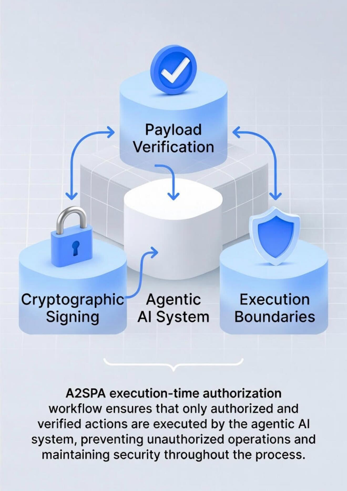

# A2SPA — Execution-Time Authorization for Agentic AI Systems
**A2SPA (Agent-to-Secure Payload Authorization)** defines an execution-time authorization control plane
for agentic AI systems.
It ensures that **no autonomous or irreversible action executes unless it is cryptographically
authorized at the exact moment of execution**.
This protocol addresses a critical architectural gap in modern AI systems:
most stacks authenticate requests and identities, but **do not re-verify intent at execution time**.
---
## Why This Exists
As AI systems shift from recommendations to **autonomous execution**, the attack surface moves
from models and prompts to **execution itself**.
Transport security (TLS) and identity controls (RBAC, OAuth, MFA) stop **before execution**.
A2SPA enforces authorization **at the execution boundary**.
If an action cannot be verified at execution time:
**it does not run.**
---
## What Is Execution-Time Authorization?
Execution-time authorization is the cryptographic verification that a **specific action**:
was explicitly authorized
has not been modified
is still valid and fresh
remains within defined constraints
**at the exact moment the action executes**.
This is especially critical for:
autonomous agents
asynchronous workflows
delayed job execution
cross-system chaining
financial, infrastructure, or permissioned actions
---
## Reference Architecture
### Execution-Time Authorization Flow

*Intent is cryptographically bound to an explicit execution payload at creation time.
That payload is re-verified inline at the execution boundary.
If verification fails due to mutation, expiration, replay, or constraint violation,
execution is blocked.*
---
### Execution Control Plane Placement

*A2SPA operates as an execution-time control plane.
It is distinct from transport security (TLS) and identity controls (RBAC, OAuth, MFA),
and gates the transition from decision to irreversible action.*
---
## What A2SPA Defines
A2SPA defines:
a signed execution payload format
freshness guarantees (nonces / timestamps)
explicit constraints and permissions
execution boundary enforcement
verifiable execution artifacts for auditability
It does **not** replace TLS, IAM, or monitoring.
It completes the stack by enforcing trust **where others stop**.
---
## Threats Addressed
A2SPA is designed to mitigate:
payload mutation after authorization
replay attacks
delayed execution with stale context
spoofed agent actions
unauthorized escalation
assumed trust in autonomous workflows
---
## Status
A2SPA is an open, reference protocol and architectural specification.
It is intended to inform implementations, standards discussions,
and execution-safe agent design.
See `SPEC.md` for the formal protocol definition.